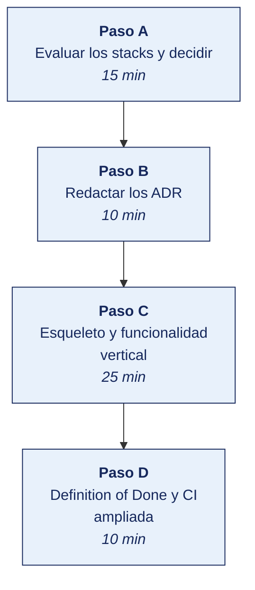

[Semana 02](README.md) · [Teoría](1-TEORIA.md) · [Dinámica de aula](2-DINAMICA.md) · **Taller de laboratorio**

# Taller de laboratorio 02 · Esqueleto por capas, decisiones de arquitectura y Definition of Done

**SI-988 · Soluciones Móviles II** · Semana 02 · Sesión 2 en laboratorio · 100 min · calificación **procedimental**

> ¿Un término no le resulta claro? Está definido en el [glosario técnico del curso](../GLOSARIO.md).

---

## Secuencia del taller



## Qué entregas

| | |
|---|---|
| **Archivo** | `SI988-S02-TALLER-Grupo<N>.pdf` |
| **Plantilla obligatoria** | [SI988-PLANTILLA-TALLER.docx](../PLANTILLAS/SI988-PLANTILLA-TALLER.docx) |
| **Formato** | PDF exportado desde la plantilla en Word, con la carátula de la UPT, el índice actualizado y las capturas numeradas |
| **Qué va dentro** | Las secciones de la plantilla. La **5. Resultados y evidencias** se califica contra la tabla de resultados esperados de esta guía, y **cada resultado necesita la evidencia que lo demuestre**. No se copian de aquí los objetivos, la duración ni los resultados de aprendizaje |
| **Dónde se sube** | Aula virtual, tarea «Taller · Semana 02» |
| **Cuándo vence** | 48 horas después de la sesión de laboratorio |

> No se califica un informe entregado en `.docx`, sin carátula, sin los códigos de los integrantes o con resultados declarados sin evidencia.

---

**La sesión de laboratorio dura 100 minutos.** El avance de Avance de proyecto lo ejecuta el equipo fuera de la sesión.

## 1. Información sobre el evento práctico

### 1.1. Título del evento práctico

Construcción del esqueleto de la aplicación con separación de capas y una funcionalidad vertical completa, documentación de las decisiones de arquitectura y de stack mediante ADR (*Architecture Decision Record*, registro de decisión de arquitectura), y formalización de la Definition of Done del equipo.

### 1.2. Objetivos

- **Evaluar los stacks candidatos** con criterios medibles y decidir con evidencia.
- Redactar **ADR-001 (arquitectura)** y **ADR-002 (stack)** con alternativas y consecuencias.
- Construir el **esqueleto por capas** con la regla de dependencia respetada.
- Implementar una **funcionalidad vertical completa** que atraviese las tres capas.
- Demostrar que el **ViewModel se prueba sin emulador**.
- Formalizar la **Definition of Done** verificable del equipo.
- Ampliar la **CI** para que verifique la DoD automáticamente.

### 1.3. Tiempo de duración

**100 minutos.**

### 1.4. Resultados de Aprendizaje (RA)

- **RA1** Analiza e interpreta los conceptos avanzados de desarrollo móvil.
- **RA2** Propone el plan de desarrollo de su app con metodologías ágiles.

### 1.5. Recursos

| Recurso | Detalle |
|---|---|
| **Guía de arquitectura de Android** | https://developer.android.com/topic/architecture |
| **Apple — App architecture** | https://developer.apple.com/documentation/swiftui/model-data |
| **Flutter — Architectural overview** | https://docs.flutter.dev/resources/architectural-overview |
| Repositorio del equipo con CI | Semana 01 |
| Herramientas de prueba del stack elegido | JUnit · XCTest · flutter_test · Jest |
| **Mermaid** o draw.io | Diagrama de arquitectura |

### 1.6. Seguridad

> **Dónde se trabaja.** El taller se hace en el **laboratorio de la universidad, sobre el emulador**. Cuando un escenario no se reproduce fielmente en el emulador, la verificación en un teléfono real la hace el equipo **fuera de la sesión** y adjunta el video como anexo. Ningún resultado del taller depende de tener un teléfono en clase.

1. La configuración del backend (URL, claves) se inyecta por **variable de entorno o archivo de configuración no versionado**, nunca embebida en el código.
2. La verificación de secretos de la CI debe seguir en verde tras agregar la funcionalidad vertical.
3. Si la funcionalidad vertical consume una API con clave, se usa una **clave de desarrollo con permisos mínimos**, distinta de la de producción.
4. El ADR-002 debe declarar **cómo se saldría del stack elegido**. Una decisión sin salida documentada es una dependencia irreversible.

---

## 2. Procedimiento o Metodología

### Paso A — Evaluar los stacks y decidir

`docs/decisiones/evaluacion_stacks.csv` — **evaluación con evidencia, no con preferencia**:

| Criterio | Peso | Flutter | React Native | Kotlin Multiplatform | Nativo | **Evidencia de la calificación** |
|---|---|---|---|---|---|---|
| Competencia actual del equipo | 25 % | | | | | Encuesta interna: N integrantes con experiencia previa |
| Soporte de las capacidades requeridas | 20 % | | | | | Se verifica biblioteca madura para: mapas, biometría, cámara |
| Madurez del ecosistema para el dominio | 15 % | | | | | N.º de bibliotecas mantenidas en los últimos 6 meses |
| Rendimiento requerido | 10 % | | | | | Según los requisitos del producto |
| Viabilidad sin macOS | 10 % | | | | | Ruta de compilación disponible |
| Curva de aprendizaje | 10 % | | | | | Tiempo estimado hasta el primer incremento |
| Mantenibilidad post-curso | 10 % | | | | | ¿Quién lo mantendrá y con qué competencia? |

**Prueba de humo obligatoria antes de decidir.** Cada equipo dedica 30 minutos a levantar un «hola mundo» **con la capacidad más crítica de su app** —mapa, cámara o biometría— en los **dos stacks finalistas**. La decisión se toma con esa evidencia, no con la documentación.

> **Regla de decisión.** Si el equipo no logra la prueba de humo de la capacidad crítica en un stack durante esos 30 minutos, ese stack **queda descartado**. No porque sea peor, sino porque el equipo no puede sostenerlo en cinco sprints.

### Paso B — Redactar los ADR

`docs/decisiones/ADR-001-arquitectura.md`:

```markdown
# ADR-001 · Arquitectura de la aplicación

- **Estado:** aceptada · **Fecha:** aaaa-mm-dd · **Decidido por:** <equipo>

## Contexto
La aplicación tendrá aproximadamente N pantallas, consumirá servicios REST y SOAP,
usará <capacidades del dispositivo> y debe funcionar sin conexión en <casos>.
El equipo tiene N integrantes con <nivel> de experiencia previa.
El horizonte del proyecto es de 5 sprints de 2 semanas.

## Alternativas consideradas
| Alternativa | Ventajas | Desventajas | Adecuación al tamaño |
|---|---|---|---|
| MVC clásico | Simple, conocido | Controladores enormes; difícil de probar | Insuficiente |
| MVVM + repositorio | Testable, estándar de la plataforma, proporcional | Sin casos de uso, la lógica puede filtrarse al ViewModel | **Adecuada** |
| Clean completa con casos de uso | Máxima separación, escala a varios equipos | Sobrecarga estructural para N pantallas | Desproporcionada |

## Decisión
**MVVM + repositorio**, con capa de dominio ligera. Se agregarán **casos de uso solo en
las funcionalidades con lógica de negocio real** (<listar cuáles>).

Reglas obligatorias:
1. La vista no contiene lógica de negocio ni llamadas de red.
2. El ViewModel no importa nada del framework de interfaz.
3. Los DTO y las entidades de dominio son **clases distintas**, unidas por un mapeador.
4. Toda dependencia se inyecta; ninguna se instancia dentro de la clase que la usa.

## Consecuencias
**Positivas:** el ViewModel se prueba sin emulador; cambiar el backend afecta solo a la
capa de datos; cada pantalla sigue el mismo patrón, reduciendo el factor bus.
**Negativas:** más archivos por pantalla; requiere disciplina en las revisiones de PR.
**Costo de revertir:** alto a partir del sprint 3.
```

`docs/decisiones/ADR-002-stack.md`, con la tabla de evaluación, el resultado de la prueba de humo, la decisión, y —obligatorio— **el plan de salida**. Qué costaría migrar a otro stack, qué parte del código sería reutilizable y en qué condiciones se reconsideraría.

### Paso C — Esqueleto y funcionalidad vertical

**Estructura de carpetas** (se adapta al stack; el principio es el mismo):

```
lib/  (o app/src/main/java/...)
├── core/
│   ├── error/            Failure, excepciones de dominio
│   ├── network/          cliente HTTP, interceptores, manejo de errores
│   └── di/               inyección de dependencias
├── features/
│   └── <funcionalidad>/
│       ├── domain/
│       │   ├── entities/       modelo del negocio
│       │   ├── repositories/   INTERFAZ (la define el dominio)
│       │   └── usecases/       solo si hay lógica real
│       ├── data/
│       │   ├── models/         DTO
│       │   ├── datasources/    remoto y local
│       │   ├── mappers/        DTO ↔ entidad
│       │   └── repositories/   IMPLEMENTACIÓN de la interfaz
│       └── presentation/
│           ├── viewmodels/
│           ├── states/
│           └── views/
└── shared/               widgets, temas, utilidades, extensiones
```

**La funcionalidad vertical.** Se implementa **una sola** funcionalidad que atraviese las tres capas de extremo a extremo. Debe incluir obligatoriamente los **cuatro estados de interfaz**:

| Estado | Qué muestra | Por qué es obligatorio |
|---|---|---|
| **Cargando** | Indicador de progreso | Sin él, la app parece congelada |
| **Éxito con datos** | El contenido | |
| **Éxito vacío** | Mensaje y acción sugerida | Una lista vacía sin mensaje parece un error |
| **Error** | Mensaje comprensible **y acción de reintento** | Un error sin salida es un callejón |

```
// Modelo de estado — el mismo principio en cualquier stack
sealed class UiState<out T> {
  object Loading                       : UiState<Nothing>()
  data class Success<T>(val data: T)   : UiState<T>()
  object Empty                         : UiState<Nothing>()
  data class Error(val message: String,
                   val retry: () -> Unit) : UiState<Nothing>()
}
```

**Prueba unitaria del ViewModel — la evidencia de que la arquitectura funciona.**

```
// Se prueba SIN emulador, SIN vista, SIN red real.
// El repositorio se sustituye por un doble porque el dominio define la INTERFAZ.

test('emite Loading y luego Success cuando el repositorio responde', () async {
  final repo = RepositorioFalso(respuesta: [entidadDePrueba]);
  final vm   = MiViewModel(repositorio: repo);

  expect(vm.estado, isA<Loading>());
  await vm.cargar();
  expect(vm.estado, isA<Success>());
  expect((vm.estado as Success).data.length, 1);
});

test('emite Error con acción de reintento cuando el repositorio falla', () async {
  final repo = RepositorioFalso(error: FallaDeRed());
  final vm   = MiViewModel(repositorio: repo);

  await vm.cargar();
  expect(vm.estado, isA<Error>());
  expect((vm.estado as Error).retry, isNotNull);
});

test('emite Empty cuando el repositorio responde sin elementos', () async {
  final repo = RepositorioFalso(respuesta: []);
  final vm   = MiViewModel(repositorio: repo);

  await vm.cargar();
  expect(vm.estado, isA<Empty>());
});
```

> **Si esta prueba requiere arrancar un emulador, la arquitectura no está bien implementada.** Es el criterio de aceptación del laboratorio.

### Paso D — Definition of Done y CI ampliada

`docs/equipo/DEFINITION_OF_DONE.md`, con la tabla de la sección 1.5, **adaptada por el equipo** y con la columna «cómo se verifica» completa en cada criterio.

**CI que verifica la DoD automáticamente.**

```yaml
name: CI
on: [push, pull_request]

jobs:
  calidad:
    runs-on: ubuntu-latest
    steps:
      - uses: actions/checkout@v4

      - name: DoD-6 · Sin secretos
        run: docker run --rm -v "$PWD":/src aquasec/trivy fs --scanners secret --exit-code 1 /src

      - name: DoD-2 · Análisis estático y linter
        run: <comando del stack>          # flutter analyze · ./gradlew ktlintCheck detekt · npm run lint

      - name: DoD-3 · Pruebas unitarias
        run: <comando del stack>          # flutter test --coverage · ./gradlew test · npm test

      - name: DoD-4 · Cobertura del dominio ≥ 70 %
        run: |
          # Se extrae la cobertura de la capa de dominio y se compara con el umbral
          <comando de extracción de cobertura>
          # falla la CI si está por debajo del 70 %

      - name: DoD-1 · Compilación
        run: <comando de compilación de depuración>
```

**Protección de la rama `main`.** Pull Request obligatorio, CI en verde requerida, **al menos una aprobación de un integrante distinto del autor**, y prohibición de forzar la escritura del historial.

### Trabajo del equipo fuera de la sesión — Avance de proyecto

> Lo que no alcance a completarse en la sesión lo ejecuta el equipo durante la semana, y llega al siguiente taller con el incremento listo. El docente lo revisa en el repositorio y en el tablero, no en clase.

| Actividad | Producto |
|---|---|
| Completar la funcionalidad vertical con sus cuatro estados | Incremento funcional |
| Escribir las tres pruebas del ViewModel | Suite en verde |
| Diagramar la arquitectura decidida | `docs/arquitectura/arquitectura.md` con Mermaid |
| Preparar el borrador del Product Backlog | Lista de historias candidatas |
| Definir el backend: propio, de terceros o simulado | Decisión con su justificación |

---


## 3. Resultados

> **Evidencia obligatoria en GitHub.** Todo resultado de este taller se versiona en el repositorio del equipo. El informe **no consigna capturas sueltas**. Consigna la **URL** del artefacto en GitHub. Una captura no permite verificar autoría, fecha ni contenido; un enlace sí.
>
> | Qué se entrega | Dónde vive | Qué se escribe en el informe |
> |---|---|---|
> | Código y archivos de configuración | Rama del taller, fusionada a `develop` vía Pull Request | URL del Pull Request |
> | Documentos y matrices | `docs/`, en formato de texto versionable | URL del archivo en la rama |
> | Capturas y videos que el taller exija | `docs/evidencias/S02/` | URL del archivo |
> | Salida de comandos | `docs/evidencias/S02/salidas/*.txt` | URL del archivo |
>
> **Etiqueta del taller.** Al cerrar el taller se crea la etiqueta `taller-02` sobre el commit entregado:
>
> ```bash
> git tag -a taller-02 -m "Taller 02 · SI988"
> git push origin taller-02
> ```
>
> La URL que se consigna en el informe apunta a esa etiqueta:
> `https://github.com/<organizacion>/<repositorio>/tree/taller-02`
>
> **El informe es lo que se califica; el repositorio es lo que lo prueba.** Cada resultado de la sección 3 del informe lleva la URL con la que se verifica, y **un resultado sin su URL se califica como no logrado**, por bien redactado que esté. Lo que no se puede abrir no se puede dar por hecho.

### 3.1. Tabla de resultados


| # | Resultado esperado | Verificación |
|---|---|---|
| 1 | Evaluación de stacks con **pesos y evidencia** por criterio | `evaluacion_stacks.csv` |
| 2 | **Prueba de humo ejecutada** en los dos stacks finalistas, con la capacidad crítica | Capturas o video |
| 3 | **ADR-001** con contexto, tres alternativas, decisión y consecuencias | `ADR-001-arquitectura.md` |
| 4 | **ADR-002** con la evaluación, la decisión y el **plan de salida** del stack | `ADR-002-stack.md` |
| 5 | Estructura de carpetas por capas creada | Repositorio |
| 6 | **Regla de dependencia respetada**: el dominio no importa nada de datos ni de presentación | Revisión del código |
| 7 | DTO y entidad de dominio como **clases distintas**, con mapeador | Repositorio |
| 8 | Funcionalidad vertical completa que atraviesa las tres capas | Demostración en dispositivo |
| 9 | **Los cuatro estados** implementados: cargando, con datos, vacío y error con reintento | Demostración |
| 10 | **Tres pruebas del ViewModel en verde, ejecutadas sin emulador** | Salida de la CI |
| 11 | Definition of Done con los 12 criterios y su forma de verificación | `DEFINITION_OF_DONE.md` |
| 12 | CI que verifica secretos, linter, pruebas y **umbral de cobertura** | Ejecución en verde |
| 13 | Rama `main` protegida con PR, CI y revisión obligatoria | Configuración |
| 14 | Diagrama de la arquitectura decidida | `docs/arquitectura/` |


## Rúbrica procedimental (20 puntos)

Se aplica sobre el informe entregado y la evidencia enlazada en el repositorio. **Cada criterio se califica de forma independiente.**

| Criterio | 4 — Logrado | 2 — En proceso | 0 — Insuficiente |
|---|---|---|---|
| **Evaluar los stacks y decidir** | Completo y correcto, con la evidencia que lo respalda | Completo con errores menores, o correcto pero sin toda la evidencia | Incompleto, o entregado sin ejecutar |
| **Esqueleto y funcionalidad vertical** | Completo y correcto, con la evidencia que lo respalda | Completo con errores menores, o correcto pero sin toda la evidencia | Incompleto, o entregado sin ejecutar |
| **Evidencia verificable en el repositorio** | Cada resultado tiene su URL sobre la etiqueta `taller-NN`, y el enlace abre lo que dice | La mayoría tiene URL; alguna evidencia es una captura suelta | Se declaran resultados sin enlace, o el enlace no corresponde |
| **Rigor técnico de la implementación** | El código compila, las pruebas pasan y el análisis estático sale limpio | Compila y funciona, con avisos del análisis sin resolver | No compila, o se entregó sin ejecutar |
| **La evidencia entregada** | Las secciones de la plantilla completas; los resultados se sustentan con la evidencia enlazada | Secciones completas con sustento parcial | Faltan secciones o los resultados se afirman sin evidencia |

| Puntaje | Equivalencia |
|---|---|
| 18 – 20 | Destacado |
| 14 – 17 | Logrado |
| 6 – 13 | En proceso |
| 0 – 5 | Insuficiente |

> **Un resultado declarado sin evidencia enlazada no se califica**, aunque el trabajo se haya hecho. La tabla de la sección 3.1 es la lista de cotejo; esta rúbrica es lo que determina la nota.

## 4. Conclusiones

Mínimo tres. Líneas argumentales esperadas:

1. La arquitectura se juzga por el costo del próximo cambio, no por su elegancia; medir cuántos archivos hay que tocar para cambiar el formato de una fecha revela más que cualquier diagrama.
2. Que el ViewModel pueda probarse sin arrancar un emulador es la evidencia objetiva de que la separación de capas existe; si la prueba requiere el emulador, la separación es nominal.
3. Una Definition of Done cuyos criterios no son verificables automáticamente se degrada a los dos sprints; la que la integración continua verifica se sostiene sola.

## 5. Referencias Bibliográficas

- Google. *Guide to app architecture*. https://developer.android.com/topic/architecture
- Google. *App architecture: UI layer* y *Data layer*. https://developer.android.com/topic/architecture/ui-layer
- Apple. *Managing model data in your app*. https://developer.apple.com/documentation/swiftui/model-data
- Flutter. *Architectural overview* y *State management*. https://docs.flutter.dev/resources/architectural-overview
- Martin, R. C. (2017). *Clean Architecture: A Craftsman's Guide to Software Structure and Design*. Prentice Hall.
- Fowler, M. *Patterns of Enterprise Application Architecture* — Model-View-Controller y Presentation Model. https://martinfowler.com/eaaCatalog/
- Nygard, M. *Documenting Architecture Decisions*. https://cognitect.com/blog/2011/11/15/documenting-architecture-decisions
- Schwaber, K. y Sutherland, J. (2020). *The Scrum Guide* — Definition of Done. https://scrumguides.org/
- Leiva, A. (2019). *Kotlin for Android Developers*. Leanpub.
- Chopra, D. D. y Khurana, R. (2023). *Flutter and Dart: Up and Running*. BPB Publications.
- Smyth, N. (2022). *SwiftUI Essentials*. Payload Media.

## 6. Anexos

- `anexo_A_evaluacion_stacks.xlsx`
- `anexo_B_prueba_humo.pdf` — evidencia de ambos stacks finalistas
- `anexo_C_ADR-001_y_ADR-002.pdf`
- `anexo_D_arquitectura.png`
- `anexo_E_pruebas_viewmodel.png` — salida de la CI
- `anexo_F_definition_of_done.pdf`

---

---

[Semana 02](README.md) · [Teoría](1-TEORIA.md) · [Dinámica de aula](2-DINAMICA.md) · **Taller de laboratorio**

---

**Docente** · Dr. Oscar Juan Jimenez Flores
[oscarjimenezflores@upt.pe](mailto:oscarjimenezflores@upt.pe) · [LinkedIn](https://www.linkedin.com/in/oscar-jimenez-flores/) · [CTI Vitae — CONCYTEC](https://ctivitae.concytec.gob.pe/appDirectorioCTI/VerDatosInvestigador.do?id_investigador=33398)

Escuela Profesional de Ingeniería de Sistemas · Universidad Privada de Tacna · Tacna, Perú
