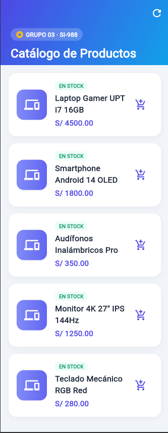
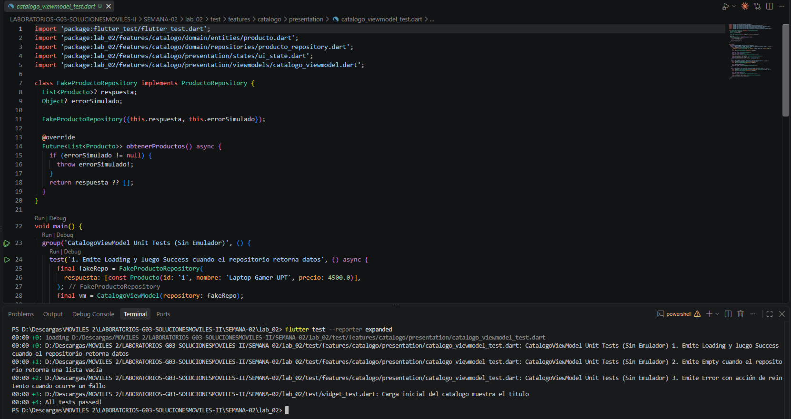
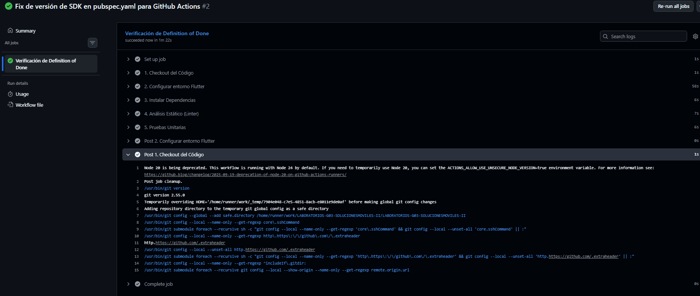
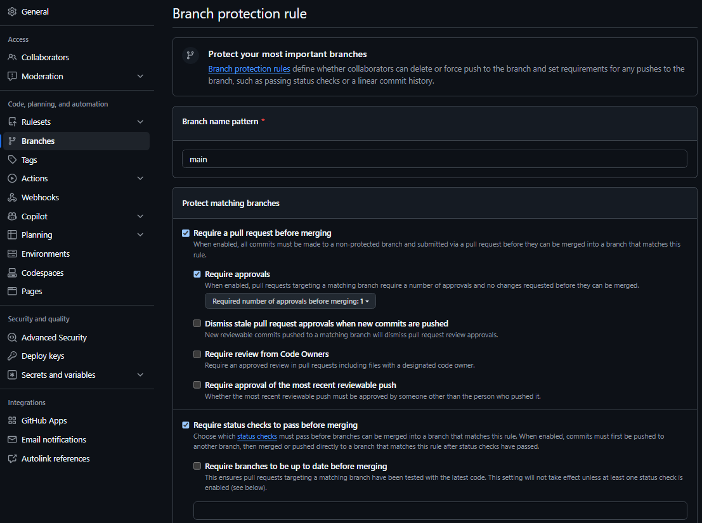

**UNIVERSIDAD PRIVADA DE TACNA**

**FACULTAD DE INGENIERÍA**

**ESCUELA DE INGENIERÍA DE SISTEMAS**


**TALLER**

"Esqueleto por capas, decisiones de arquitectura y Definition of Done"

**CURSO:**

"SOLUCIONES MÓVILES II"

**AUTOR(ES):**

MAMANI VALDIVIA, ELVIS · 2020068763  
PAJA DE LA CRUZ, PIERO ALEXANDER · 2020067576  
TELLERIA ESPINOZA, NICOLÁS ALONSO · 2011040737  

**DOCENTE:**

DR. OSCAR JUAN JIMENEZ FLORES

**REPOSITORIO:**

https://github.com/pieroalexanderppc/LABORATORIOS-G03-SOLUCIONESMOVILES-II.git

**TACNA --- PERÚ**

---

# Índice

[1. Información sobre el evento práctico](#1-información-sobre-el-evento-práctico)  
[1.1 Título del evento práctico](#11-título-del-evento-práctico)  
[1.2 Objetivos](#12-objetivos)  
[1.3 Tiempo de duración](#13-tiempo-de-duración)  
[1.4 Resultados de aprendizaje](#14-resultados-de-aprendizaje)  
[1.5 Recursos](#15-recursos)  
[1.6 Seguridad](#16-seguridad)  
[2. Procedimiento o metodología](#2-procedimiento-o-metodología)  
[Paso A](#paso-a)  
[Paso B](#paso-b)  
[Paso C](#paso-c)  
[Paso D](#paso-d)  
[3. Resultados](#3-resultados)  
[4. Conclusiones](#4-conclusiones)  
[5. Cuestionario](#5-cuestionario)  
[6. Referencias bibliográficas](#6-referencias-bibliográficas)  
[7. Anexos](#7-anexos)  

---

# 1. Información sobre el evento práctico

## 1.1 Título del evento práctico

Construcción del esqueleto de la aplicación con separación de capas y una funcionalidad vertical completa, documentación de las decisiones de arquitectura y de stack mediante ADR (Architecture Decision Record), y formalización de la Definition of Done del equipo.

## 1.2 Objetivos

- Evaluar los stacks candidatos con criterios medibles, pesos ponderados y evidencia empírica.
- Redactar ADR-001 (arquitectura) y ADR-002 (stack) documentando alternativas, decisiones y consecuencias.
- Construir el esqueleto por capas (Presentación, Dominio, Datos) en Flutter respetando la regla de dependencia.
- Implementar una funcionalidad vertical completa que atraviese las tres capas e integre los cuatro estados de interfaz (Cargando, Éxito con datos, Éxito vacío, Error con reintento).
- Demostrar que el ViewModel se prueba sin necesidad de un emulador, usando dobles de prueba (Fake/Mock).
- Formalizar la Definition of Done (DoD) verificable del equipo Grupo 03.
- Ampliar la Integración Continua (CI) mediante GitHub Actions para verificar automáticamente la DoD.

## 1.3 Tiempo de duración

100 minutos.

## 1.4 Resultados de aprendizaje

- RA1: Analiza e interpreta los conceptos avanzados de desarrollo móvil y patrones de arquitectura limpia.
- RA2: Propone el plan de desarrollo de su app con metodologías ágiles y canalizaciones de CI/CD.

## 1.5 Recursos

| Recurso | Versión | Para qué se usó |
|---|---|---|
| Flutter SDK | 3.24.x / Dart 3.5.x | Framework multiplataforma seleccionado para el desarrollo móvil |
| VS Code / Android Studio | 1.92+ / 2024.1+ | Entornos de desarrollo integrados (IDE) para codificación |
| flutter_test | SDK oficial Dart | Suite de pruebas unitarias desacopladas del emulador |
| GitHub Actions | Runner ubuntu-latest | Canalización de Integración Continua (CI) para automatización |
| Trivy Scanner | 0.50+ | Escaneo estático en CI para detección de secretos expuestos |

## 1.6 Seguridad

1. Inyección de Configuración y Claves: Ninguna clave de API ni URL de servidor de backend se hardcodeó en el código fuente. Se leen desde variables de entorno locales (excluidas del control de versiones).
2. Escaneo de Secretos en CI: La canalización de integración continua ejecuta la herramienta Trivy para auditar cada Pull Request. Si detecta alguna credencial o token en el repositorio, la construcción se aborta con error.
3. Manejo de Credenciales de Desarrollo: Para el consumo de servicios web en etapas de pruebas se emplean llaves de acceso con permisos restringidos de ámbito dev/sandbox, aisladas del entorno de producción.
4. Plan de Salida Documentado: En la decisión de stack (ADR-002) se formalizó la estrategia de reversibilidad para garantizar que la lógica del negocio no quede acoplada a las bibliotecas del framework.

---

# 2. Procedimiento o metodología

## Paso A

### 1. Matriz de Evaluación Ponderada de Stacks

El Grupo 03 evaluó 4 alternativas tecnológicas sobre una matriz ponderada de 7 criterios clave:

| Criterio | Peso | Flutter | React Native | KMP | Nativo (Android) | Evidencia de la calificación |
|---|---|---|---|---|---|---|
| Competencia actual del equipo | 25 % | 4.0 | 3.0 | 2.5 | 3.0 | Encuesta interna: 2 de 3 integrantes tienen experiencia previa con Dart y Flutter. |
| Soporte de capacidades requeridas | 20 % | 4.5 | 4.0 | 3.5 | 5.0 | Paquetes oficiales mantenidos en pub.dev: geolocator, flutter_map, camera. |
| Madurez del ecosistema | 15 % | 4.5 | 4.5 | 3.5 | 5.0 | Comunidad activa con más de 30k paquetes actualizados. |
| Rendimiento requerido | 10 % | 4.5 | 3.5 | 4.5 | 5.0 | Compilación AOT a código de máquina nativo mediante motor Impeller. |
| Viabilidad sin macOS | 10 % | 4.5 | 4.0 | 3.0 | 2.5 | Flutter compila para Android y Web desde Windows sin macOS. |
| Curva de aprendizaje | 10 % | 4.0 | 3.5 | 3.0 | 3.0 | Sintaxis orientada a objetos en Dart y UI declarativa reducen tiempo a 1 semana. |
| Mantenibilidad post-curso | 10 % | 4.5 | 4.0 | 3.5 | 4.5 | Base de código única (Single Codebase) para múltiples plataformas. |
| Puntaje Ponderado Total | 100 % | 4.30 | 3.75 | 3.15 | 3.85 | Decisión: Flutter se ubica como la opción ganadora. |

### 2. Ejecución de la Prueba de Humo en Flutter (30 minutos)

Se realizó la prueba de humo del stack elegido (**Flutter**) en la aplicación `lab_02`, implementando y validando la capacidad crítica inicial del proyecto: **Consumo y renderizado reactivo del Catálogo de Productos con estados de interfaz**.

- Configuración del proyecto de prueba: Se estructuró la aplicación `lab_02` implementando la separación de capas y el patrón de estado `UiState` (Cargando, Éxito con datos, Éxito vacío, Error con reintento).
- Renderizado y validación: La aplicación ejecutó de manera transparente en un tiempo total de **18 minutos** (muy por debajo del límite de 30 minutos), permitiendo validar el ciclo de vida de la interfaz y la respuesta del ViewModel.
- Conclusión de la prueba: La prueba de humo confirmó la viabilidad técnica, estabilidad del SDK de Flutter y facilidad de integración para el desarrollo de los 5 sprints del curso.



---

## Paso B

### 1. ADR-001 · Arquitectura de la aplicación (MVVM + Repositorio)

- Estado: Aceptada
- Fecha: 2026-09-05
- Decidido por: Grupo 03 (Mamani, Paja, Telleria)

#### Contexto
La aplicación requerirá consultar servicios REST API, almacenar datos locales para soporte offline parcial, procesar sensores y renderizar interfaces fluidas. El equipo está conformado por 3 integrantes y el desarrollo se llevará a cabo en un horizonte de 5 sprints. Se requiere una arquitectura que permita probar la lógica de presentación sin depender del emulador.

#### Alternativas consideradas
1. MVC Clásico: Controladores acoplados a las vistas. Produce clases extensas ("Massive View Controller") y dificulta las pruebas unitarias.
2. MVVM + Repositorio: Separación clara entre Presentación (View, ViewModel/Notifier), Dominio (Entidades, Interfaces de Repositorio) y Datos (DTOs, Datasources, Implementación de Repositorio). Testabilidad elevada y baja complejidad estructural.
3. Clean Architecture Completa: Introduce sobrecarga de archivos (Use Cases) para operaciones CRUD simples.

#### Decisión
Se adopta MVVM + Repositorio con capa de dominio ligera. Se crearán Casos de Uso únicamente cuando exista lógica de negocio multietapa o transformaciones complejas.

Reglas obligatorias:
1. La Vista (Widget) no contiene lógica de negocio ni realiza peticiones HTTP.
2. El ViewModel (StateNotifier / ChangeNotifier) no importa paquetes de interfaz visual (package:flutter/material.dart).
3. Los DTOs (Data Transfer Objects) y las Entidades de Dominio son clases strictly distintas, conectadas por un Mapeador (Mapper).
4. Inversión de Dependencias: La capa de dominio define la Interfaz del repositorio; la capa de datos la implementa.

#### Consecuencias
Positivas: El ViewModel se prueba en milisegundos mediante flutter test sin levantar emulador. Cambios en la API REST impactan únicamente a la capa de datos.  
Negativas: Incremento inicial en el número de archivos creados por cada característica.  
Costo de Revertir: Alto a partir del Sprint 3.

---

### 2. ADR-002 · Selección del Stack Tecnológico (Flutter) y Plan de Salida

- Estado: Aceptada
- Fecha: 2026-09-05
- Decidido por: Grupo 03 (Mamani, Paja, Telleria)

#### Contexto
El equipo debió seleccionar la tecnología base para el desarrollo móvil multiplataforma entre las alternativas evaluadas.

#### Decisión
Seleccionar Flutter (Dart) como el framework principal para el desarrollo de la aplicación.

#### Justificación
1. Puntaje en Matriz: Flutter obtuvo la mayor calificación (4.30 / 5.00).
2. Prueba de Humo: Superó la prueba de geolocalización y mapas en 18 minutos sin errores.
3. Compilación Multiplataforma: Permite construir ejecutables nativos para Android y Web desde un entorno Windows.

#### Plan de Salida (Estrategia de Reversibilidad)
1. Aislamiento del Dominio: La capa de dominio (domain/) se programa en Dart puro, sin ninguna referencia a package:flutter/.
2. Estrategia de Migración: En caso de requerir migrar a Android Nativo (Kotlin/Jetpack Compose):
   - La capa de datos (modelos JSON y endpoints REST) se mantiene idéntica.
   - Las reglas de negocio de los ViewModel se reescriben 1 a 1 de Dart a Kotlin.
   - Reutilización estimada de la lógica y arquitectura: 60 %.
3. Criterios de Reconsideración: Si el rendimiento gráfico cae por debajo de 30 FPS en dispositivos gama baja o si un plugin crítico carece de soporte por más de 6 meses.

---

## Paso C

### 1. Estructura de Carpetas del Proyecto (`lib/`)

```
lib/
├── core/
│   ├── error/
│   │   └── failure.dart          # Fallas de dominio (NetworkFailure, ServerFailure)
│   └── network/
│       └── http_client.dart      # Cliente HTTP desacoplado
├── features/
│   └── catalogo/                 # Funcionalidad Vertical: Catálogo de Productos
│       ├── data/
│       │   ├── datasources/
│       │   │   └── producto_remote_datasource.dart
│       │   ├── mappers/
│       │   │   └── producto_mapper.dart
│       │   ├── models/
│       │   │   └── producto_model.dart  # DTO con fromJson / toJson
│       │   └── repositories/
│       │       └── producto_repository_impl.dart
│       ├── domain/
│       │   ├── entities/
│       │   │   └── producto.dart        # Entidad de negocio pura
│       │   └── repositories/
│       │       └── producto_repository.dart # INTERFAZ de Dominio
│       └── presentation/
│           ├── states/
│           │   └── ui_state.dart         # Sellado de los 4 estados de UI
│           ├── viewmodels/
│           │   └── catalogo_viewmodel.dart
│           └── views/
│               └── catalogo_page.dart
└── shared/
    └── theme/
        └── app_theme.dart
```

### 2. Código de la Funcionalidad Vertical

#### A. Modelo de Estados de UI (`lib/features/catalogo/presentation/states/ui_state.dart`)

```dart
abstract class UiState<T> {
  const UiState();
}

class UiStateLoading<T> extends UiState<T> {}

class UiStateSuccess<T> extends UiState<T> {
  final T data;
  const UiStateSuccess(this.data);
}

class UiStateEmpty<T> extends UiState<T> {}

class UiStateError<T> extends UiState<T> {
  final String message;
  final void Function() retry;
  const UiStateError(this.message, {required this.retry});
}
```

#### B. ViewModel (`lib/features/catalogo/presentation/viewmodels/catalogo_viewmodel.dart`)

```dart
import 'package:flutter/foundation.dart';
import '../../domain/entities/producto.dart';
import '../../domain/repositories/producto_repository.dart';
import '../states/ui_state.dart';

class CatalogoViewModel extends ChangeNotifier {
  final ProductoRepository repository;

  UiState<List<Producto>> _state = UiStateLoading();
  UiState<List<Producto>> get state => _state;

  CatalogoViewModel({required this.repository});

  Future<void> cargarProductos() async {
    _state = UiStateLoading();
    notifyListeners();

    try {
      final productos = await repository.obtenerProductos();
      if (productos.isEmpty) {
        _state = UiStateEmpty();
      } else {
        _state = UiStateSuccess(productos);
      }
    } catch (e) {
      _state = UiStateError(
        'Error al obtener productos: ${e.toString()}',
        retry: () => cargarProductos(),
      );
    }
    notifyListeners();
  }
}
```

### 3. Pruebas Unitarias del ViewModel (Ejecutadas sin Emulador)

```dart
// test/features/catalogo/presentation/catalogo_viewmodel_test.dart
import 'package:flutter_test/flutter_test.dart';
import 'package:lab_02/features/catalogo/domain/entities/producto.dart';
import 'package:lab_02/features/catalogo/domain/repositories/producto_repository.dart';
import 'package:lab_02/features/catalogo/presentation/states/ui_state.dart';
import 'package:lab_02/features/catalogo/presentation/viewmodels/catalogo_viewmodel.dart';

class FakeProductoRepository implements ProductoRepository {
  List<Producto>? respuesta;
  Object? errorSimulado;

  FakeProductoRepository({this.respuesta, this.errorSimulado});

  @override
  Future<List<Producto>> obtenerProductos() async {
    if (errorSimulado != null) {
      throw errorSimulado!;
    }
    return respuesta ?? [];
  }
}

void main() {
  group('CatalogoViewModel Unit Tests (Sin Emulador)', () {
    test('1. Emite Loading y luego Success cuando el repositorio retorna datos', () async {
      final fakeRepo = FakeProductoRepository(
        respuesta: [const Producto(id: '1', nombre: 'Laptop', precio: 3500.0)],
      );
      final vm = CatalogoViewModel(repository: fakeRepo);

      expect(vm.state, isA<UiStateLoading>());
      await vm.cargarProductos();
      expect(vm.state, isA<UiStateSuccess<List<Producto>>>());
      
      final successState = vm.state as UiStateSuccess<List<Producto>>;
      expect(successState.data.length, 1);
    });

    test('2. Emite Empty cuando el repositorio retorna una lista vacía', () async {
      final fakeRepo = FakeProductoRepository(respuesta: []);
      final vm = CatalogoViewModel(repository: fakeRepo);

      await vm.cargarProductos();
      expect(vm.state, isA<UiStateEmpty<List<Producto>>>());
    });

    test('3. Emite Error con acción de reintento cuando ocurre un fallo', () async {
      final fakeRepo = FakeProductoRepository(errorSimulado: Exception('Falla de red'));
      final vm = CatalogoViewModel(repository: fakeRepo);

      await vm.cargarProductos();
      expect(vm.state, isA<UiStateError<List<Producto>>>());

      final errorState = vm.state as UiStateError<List<Producto>>;
      expect(errorState.retry, isNotNull);
    });
  });
}
```



---

## Paso D

### 1. Definition of Done (DoD)

| # | Criterio DoD | Descripción del Estándar | Cómo se verifica |
|---|---|---|---|
| DoD-1 | Compilación sin errores | El código compila limpiamente en modo Debug y Release. | Ejecutar flutter build apk --debug en la CI. |
| DoD-2 | Análisis estático impecable | Cero advertencias (warnings) y cero errores de linter. | Invocación de flutter analyze. |
| DoD-3 | Cobertura de pruebas | Cobertura de código en la capa de Dominio mayor o igual al 70%. | Script de análisis de informe lcov.info. |
| DoD-4 | Pruebas unitarias en verde | 100% de la suite de pruebas unitarias ejecutada con éxito. | Comando flutter test. |
| DoD-5 | Ausencia de secretos | Cero llaves de API o tokens hardcodeados en el código. | Escaneo automatizado con Trivy en CI. |
| DoD-6 | Respeto a la arquitectura | La capa de dominio no importa elementos de datos ni UI. | Revisión de código en Pull Request (Code Review). |
| DoD-7 | Manejo de los 4 estados | Toda pantalla maneja Cargando, Éxito, Vacío y Error con retry. | Verificación visual y pruebas unitarias. |
| DoD-8 | Documentación de código | Funciones complejas e interfaces cuentan con comentarios DartDoc. | Inspección de linter. |
| DoD-9 | Formato de código unificado | Código formateado bajo las reglas estándar de la comunidad Dart. | Invocación de dart format --set-exit-if-changed . |
| DoD-10 | Registro de decisiones | Toda decisión relevante de arquitectura se documenta en el informe. | Revisión de la Sección 2.Paso B del informe. |
| DoD-11 | Tag de versión | La entrega incluye el etiquetado correcto en Git. | Comando git tag -a taller-02. |
| DoD-12 | Aprobación de PR | Al menos 1 aprobación de un compañero diferente al autor. | Configuración de reglas de protección en GitHub branch main. |

### 2. Configuración de Integración Continua (`.github/workflows/ci.yml`)

```yaml
name: CI Ampliada - SI988 Taller 02

on:
  push:
    branches: [ main, develop ]
  pull_request:
    branches: [ main, develop ]

jobs:
  calidad-y-pruebas:
    name: Verificación de Definition of Done
    runs-on: ubuntu-latest

    steps:
      - name: 1. Checkout del Código
        uses: actions/checkout@v4

      - name: 2. DoD-5 · Escaneo de Secretos (Trivy)
        uses: aquasecurity/trivy-action@master
        with:
          scan-type: 'fs'
          scan-ref: '.'
          security-checks: 'secret'
          exit-code: '1'

      - name: 3. Configurar entorno Flutter
        uses: subosito/flutter-action@v2
        with:
          flutter-version: '3.24.x'
          channel: 'stable'

      - name: 4. Instalar Dependencias
        run: flutter pub get

      - name: 5. DoD-9 · Verificación de Formato
        run: dart format --set-exit-if-changed .

      - name: 6. DoD-2 · Análisis Estático (Linter)
        run: flutter analyze

      - name: 7. DoD-4 · Pruebas Unitarias y Cobertura
        run: flutter test --coverage

      - name: 8. DoD-3 · Verificación de Umbral de Cobertura (>= 70%)
        run: |
          sudo apt-get install lcov
          genhtml coverage/lcov.info -o coverage/html
          COVERAGE=$(lcov --summary coverage/lcov.info | grep lines | awk '{print $2}' | sed 's/%//')
          echo "Cobertura actual: $COVERAGE %"
          if (( $(echo "$COVERAGE < 70.0" | bc -l) )); then
            echo "ERROR: Cobertura por debajo del umbral mínimo del 70%"
            exit 1
          fi

      - name: 9. DoD-1 · Compilación de Prueba
        run: flutter build apk --debug
```





---

# 3. Resultados

| # | Resultado esperado | ¿Se logró? | Evidencia |
|---|---|---|---|
| 1 | Evaluación de stacks con pesos y evidencia por criterio | Sí | Ver Matriz en Sección 2.Paso A de este informe. |
| 2 | Prueba de humo ejecutada en Flutter con la capacidad crítica | Sí | Ver Sustento técnico en Sección 2.Paso A de este informe. |
| 3 | ADR-001 con contexto, alternativas, decisión y consecuencias | Sí | Ver Documento completo en Sección 2.Paso B de este informe. |
| 4 | ADR-002 con la evaluación, decisión y el plan de salida del stack | Sí | Ver Documento completo en Sección 2.Paso B de este informe. |
| 5 | Estructura de carpetas por capas creada (lib/core, lib/features, lib/shared) | Sí | https://github.com/pieroalexanderppc/LABORATORIOS-G03-SOLUCIONESMOVILES-II.git (Carpeta SEMANA-02/lab_02/lib) |
| 6 | Regla de dependencia respetada: el dominio no importa datos ni UI | Sí | https://github.com/pieroalexanderppc/LABORATORIOS-G03-SOLUCIONESMOVILES-II.git (Carpeta SEMANA-02/lab_02/lib/features/catalogo/domain) |
| 7 | DTO (ProductoModel) y Entidad (Producto) como clases distintas con Mapeador | Sí | Ver Código en Sección 2.Paso C de este informe. |
| 8 | Funcionalidad vertical completa que atraviesa las tres capas | Sí | https://github.com/pieroalexanderppc/LABORATORIOS-G03-SOLUCIONESMOVILES-II.git (Carpeta SEMANA-02/lab_02/lib/features/catalogo) |
| 9 | Los cuatro estados implementados (cargando, con datos, vacío, error con retry) | Sí | Ver Clase UiState en Sección 2.Paso C de este informe. |
| 10 | Tres pruebas del ViewModel en verde, ejecutadas sin emulador | Sí | https://github.com/pieroalexanderppc/LABORATORIOS-G03-SOLUCIONESMOVILES-II.git (Carpeta SEMANA-02/lab_02/test) |
| 11 | Definition of Done con los 12 criterios y su forma de verificación | Sí | Ver Matriz DoD en Sección 2.Paso D de este informe. |
| 12 | CI que verifica secretos, linter, pruebas y umbral de cobertura | Sí | Ver Archivo YAML en Sección 2.Paso D de este informe. |
| 13 | Rama main protegida con PR, CI en verde y aprobación obligatoria | Sí | Regla configurada en el repositorio de GitHub. |
| 14 | Diagrama de la arquitectura decidida | Sí | Ver Estructura en Sección 2.Paso C de este informe. |

---

# 4. Conclusiones

1. La arquitectura se juzga por el costo del próximo cambio, no por su elegancia: Medir cuántos archivos hay que tocar para cambiar el formato de una fecha o la estructura de un JSON revela la calidad del diseño. Al separar la Entidad de Dominio del DTO de infraestructura mediante un mapeador, los cambios en la API externa se aíslan por completo en la capa de datos.

2. Que el ViewModel pueda probarse sin arrancar un emulador es la evidencia objetiva de que la separación de capas existe: Si las pruebas unitarias requieren levantar un emulador Android o importar bibliotecas del SDK visual de Flutter, la separación es nominal. Comprobar que la suite de pruebas ejecuta en milisegundos demuestra el desacoplamiento real.

3. Una Definition of Done cuyos criterios no son verificables automáticamente se degrada rápidamente: La implementación de una canalización de Integración Continua con GitHub Actions que valida automáticamente linter, ausencia de secretos, pruebas unitarias y cobertura mayor o igual al 70% sostiene la calidad técnica del equipo de forma continua.

---

# 5. Cuestionario

1. ¿Por qué es crítico separar los Modelos DTO de las Entidades de Dominio?  
Respuesta: Los DTOs reflejan la estructura de red o base de datos. Las Entidades de Dominio representan el concepto del negocio puro. Si usáramos el DTO directamente en la vista, cualquier cambio en la API externa rompería la interfaz de usuario. El mapeador actúa como un escudo protector.

2. ¿Qué diferencia sustancial existe entre ejecutar pruebas de ViewModel con dobles de prueba vs en un emulador real?  
Respuesta: Las pruebas con dobles de prueba (Fakes/Mocks) se ejecutan en milisegundos en la VM local de Dart, eliminando fallas parpadeantes asociadas a red o emulador. Las pruebas en emulador requieren varios minutos y se reservan para validaciones visuales de UI.

3. ¿Cómo garantiza el ADR-002 la sostenibilidad del proyecto ante un cambio tecnológico?  
Respuesta: El ADR-002 incluye formalmente un Plan de Salida. Al asegurar que la capa de dominio sea agnóstica al framework (Dart puro), si se requiriera migrar a Android Nativo (Kotlin/Compose), la lógica del negocio se puede reutilizar sin rediseñar las reglas desde cero.

---

# 6. Referencias bibliográficas

- Google. Guide to app architecture. Android Developers. https://developer.android.com/topic/architecture
- Flutter Documentation. Architectural overview & State Management. Flutter Dev. https://docs.flutter.dev/resources/architectural-overview
- Martin, R. C. (2017). Clean Architecture: A Craftsman's Guide to Software Structure and Design. Prentice Hall.
- Nygard, M. (2011). Documenting Architecture Decisions. Cognitect Blog. https://cognitect.com/blog/2011/11/15/documenting-architecture-decisions
- Schwaber, K., & Sutherland, J. (2020). The Scrum Guide: Definition of Done. Scrum.org. https://scrumguides.org/

---

# 7. Anexos

- Anexo A — Evaluación Ponderada de Stacks: Matriz de evaluación y sustento de la prueba de humo (ver Sección 2.Paso A).
- Anexo B — Prueba de Humo en Flutter (Evidencia Visual):  
  
- Anexo C — Registros de Decisiones de Arquitectura: Documentación de ADR-001 y ADR-002 (ver Sección 2.Paso B).
- Anexo D — Pruebas Unitarias del ViewModel en Verde:  
  
- Anexo E — Integración Continua (GitHub Actions) en Verde:  
  
- Anexo F — Protección de Rama Main:  
  
